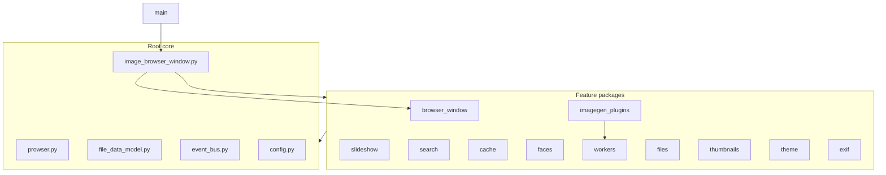

# Prowser codebase restructure plan

Deliverable: [docs/restructure-plan.md](docs/restructure-plan.md) (this plan, kept in-repo for step-by-step execution).

## Principles (every step)

- **Move-only**: `git mv` files; update `import` paths and build/copy scripts. No behavior changes, refactors, or renames unless required to break an import cycle.
- **One domain per step**: Each step creates or extends **one** package; land, test, then continue.
- **Flat packages at repo root** (your choice): `slideshow/`, `search/`, `cache/`, etc. sit beside [browser_window/](browser_window/) and [imagegen_plugins/](imagegen_plugins/). Do **not** use the empty [prowser/](prowser/) umbrella unless a later optional step explicitly migrates.
- **Thin core stays at root**: [prowser.py](prowser.py), [image_browser_window.py](image_browser_window.py), [config.py](config.py), [file_data_model.py](file_data_model.py), [event_bus.py](event_bus.py), [utils.py](utils.py), [sort_mode.py](sort_mode.py).
- **Dependency rules** (document in [ARCHITECTURE.md](ARCHITECTURE.md) after Step 0):
  - Core must not import UI packages.
  - Feature packages must not `import image_browser_window` (use `sort_mode`, `event_bus`, duck-typed `main_window` args).
  - [imagegen_plugins/](imagegen_plugins/) must not import `image_browser_window` (already: lazy import from `browser_window.*`).



## Per-step workflow (repeat for each step)

1. Create package dir + `__init__.py` (optional re-exports of public API).
2. `git mv` listed modules into the package.
3. Global search-replace imports: `from foo import` → `from package.foo import` (or `from package import foo` if re-exported).
4. Update [copy_project_files.sh](copy_project_files.sh) (mirror [browser_window/](browser_window/) copy loop).
5. Run verification (below).
6. Commit with message like `refactor: move slideshow modules into slideshow/ package`.

### Verification checklist (every step)

```bash
source venv_image_browser/bin/activate
python -m compileall -q .   # or targeted package
python -c "import image_browser_window; import prowser"
./prowser.py /tmp              # smoke: window opens
python -m pytest tests/ -q  # if tests touch moved modules
```

PyInstaller: entry is [prowser.py](prowser.py) with `pathex` to repo root ([Prowser.spec](Prowser.spec)); new packages are usually discovered automatically. If a frozen build fails with `ModuleNotFoundError`, add the package to hiddenimports in spec/directives.

---

## Step 0 — Import hygiene (small code change, not a move)

**Goal**: Remove fragile lazy imports of `SortMode` from `image_browser_window` before moving large file modules.

**Change** (4 files, ~6 lines each): replace `from image_browser_window import SortMode` with `from sort_mode import SortMode` in:

- [file_tree_handler.py](file_tree_handler.py) (lazy sites ~L1513, ~L1620)
- [file_operations_manager.py](file_operations_manager.py) (lazy sites)
- [thumbnail_canvas.py](thumbnail_canvas.py)
- [status_bar_config.py](status_bar_config.py)
- [browser_window/directory_history_handler.py](browser_window/directory_history_handler.py)

**Also**: Add a short "Package boundaries" section to [ARCHITECTURE.md](ARCHITECTURE.md).

**Risk**: Low. **Test**: compile + `./prowser.py`.

---

## Step 1 — `slideshow/` package (safest first move)

**Why first**: Each manager has **one** importer ([image_browser_window.py](image_browser_window.py)); no back-imports to IBW.

**Move**:

| From root | To |
|-----------|-----|
| `slideshow_manager.py` | `slideshow/manager.py` or keep names |
| `slideshow2_manager.py` | `slideshow/manager2.py` |
| `slideshow3_manager.py` | `slideshow/manager3.py` |
| `slideshow_image_loader.py` | `slideshow/image_loader.py` |

Prefer **keeping original filenames** inside `slideshow/` (`slideshow_manager.py`, etc.) to minimize diff noise.

**Update imports in**: [image_browser_window.py](image_browser_window.py) only (top-level slideshow imports).

**Internal**: managers keep lazy import of `slideshow_image_loader` → update to `from slideshow.slideshow_image_loader import ...`.

**~3,941 lines total.**

---

## Step 2 — `theme/` package

**Move** (5 files, ~2,423 lines):

- `theme.py`, `theme_service.py`, `theme_base.py`, `theme_defaults.py`, `dark_theme_definitions.py`

**Importers**: widespread but no IBW back-imports. Grep `from theme` / `import theme_service` across repo and update.

**Note**: `light_theme_definitions` was merged into `theme_service` earlier; no separate file.

---

## Step 3 — `exif/` package

**Move** (2 files, ~1,458 lines):

- `exif_utils.py`, `exif_image_loader.py`

**Importers**: many (imagegen, browser_window dialogs, thumbnails). Straightforward path updates.

**Do not move** [browser_window/](browser_window/) EXIF dialogs yet (already packaged).

**Optional tiny decouple** (only if Step 8 blocks): extract `browse_view_handler._draw_diamond_pattern` to `exif/draw_patterns.py` so `exif_image_loader` does not import all of `browse_view_handler` — defer unless needed.

---

## Step 4 — `search/` package (similarity + references, phase A)

**Move low-coupling modules first**:

- `similarity_reorder.py` (1 importer: `browser_window/similarity_search_manager.py`)
- `similarity_bootstrap.py` (2 importers)
- `reference_graph.py`, `reference_graph_layout.py` (6 / 3 importers; no IBW top-level import)

**Update**: [browser_window/similarity_search_manager.py](browser_window/similarity_search_manager.py), [thumbnail_canvas.py](thumbnail_canvas.py), [information_sidebar.py](information_sidebar.py), imagegen edit dialog, etc.

**Defer to Step 4b** (separate commit): `cnn_image_similarity_sorter.py` (3,807 lines; ties to `feature_cache_manager`, torch, `face_sample_thumbnail`). Say **"implement step 4b"** when ready.

---

## Step 5 — `cache/` package

**Move in order** (internal dep: `image_cache` → `thumbnail_cache_key`):

1. `thumbnail_cache_key.py`
2. `idle_and_cache_constants.py`
3. `feature_cache_manager.py`
4. `cache_prepopulator.py`
5. `image_cache.py`

**Also move from** [browser_window/](browser_window/): `background_cache_importer.py` → `cache/background_importer.py` (or keep name).

**Importers**: [image_browser_window.py](image_browser_window.py), [settings_dialog.py](settings_dialog.py), [file_operations_manager.py](file_operations_manager.py), workers, CNN sorter (after 4b).

---

## Step 6 — `faces/` package

**Move in order** (respect `face_scan_runner` → `file_tree_handler` dep; do after Step 8 if that import remains, or keep `file_tree_handler` import as root path until Step 8):

1. `face_gathering_coordinator.py`
2. `known_faces_manager.py`
3. `face_sample_cache.py`, `face_sample_thumbnail.py`
4. `face_engine.py`, `face_cache.py`
5. `face_scan_runner.py`

**Importers**: [settings_dialog.py](settings_dialog.py), [background_clip_worker.py](background_clip_worker.py), [window_background_workers.py](window_background_workers.py), IBW lazy imports.

---

## Step 7 — `workers/` package

**Move**:

- `window_background_workers.py`
- `background_clip_worker.py`
- `model_tasks_launch.py`
- `model_tasks_controller.py`
- `model_tasks_worker.py`

**Also move from** [browser_window/](browser_window/): `beachball_fix.py`, `idle_detector.py`, `message_handler.py` (background/concurrency helpers).

**Careful**: [imagegen_plugins/](imagegen_plugins/) and pipelines import perf helpers from `model_tasks_worker` after prior consolidation. Update those imports to `workers.model_tasks_worker`.

**Do not move** [imagegen_plugins/](imagegen_plugins/) itself.

---

## Step 8 — `files/` package (phase A: easy wins)

**Move first**:

- `browse_view_handler.py` (2 importers)
- `file_move_handler.py`, `prsort_io.py`, `convert_format.py`, `external_editor.py`, `map_manager.py`, `photos_library_paths.py`, `image_extensions_helpers.py`, `cr2_raw_loader.py`

**Defer phase B** (**step 8b**): `file_tree_handler.py` (5,430 lines, 6 importers, lazy `SortMode` — Step 0 must be done) and `file_operations_manager.py` (6,906 lines). These are the highest-risk root files.

**Optional phase C**: Move related [browser_window/](browser_window/) modules (`directory_loader`, `directory_history_handler`, `navigation_manager`, `selection_manager`, `refresh_manager`, `lock_manager`, `rename_status_manager`) into `files/` or a `browser_window/files/` subpackage — only after 8b is stable.

---

## Step 9 — `thumbnails/` package

**Large, central UI** — do after files/search/cache are stable.

**Move**:

- `thumbnail_canvas.py`, `thumbnail_constants.py`, `thumbnail_operations_manager.py`, `thumbnail_cache_key.py` (if not in cache/ — **choose one home**: cache key lives in `cache/` only; thumbnails import from there)
- `list_canvas.py`, `list_canvas_manager` is inside [view_manager.py](view_manager.py) (merged) — move `view_manager.py` as a whole
- `browse_view_handler` already in `files/` if Step 8 done
- `combined_sidebar_widget.py`, `information_sidebar.py`, `sidebar_pane_layout.py`

**Defer**: [keyboard_handler.py](keyboard_handler.py) (3,137 lines), [menu_manager.py](menu_manager.py), [status_bar_config.py](status_bar_config.py), [settings_dialog.py](settings_dialog.py) (8,722 lines) — separate **step 9b** `ui/` or keep at root until settings split is designed.

---

## Step 10 — `browser_window/` subpackage tidy (optional, cosmetic)

Reorganize [browser_window/](browser_window/) **without** renaming public classes:

```
browser_window/
  managers/     # selection_manager, navigation_manager, ...
  dialogs/      # help_*, exif_*, about_dialog, ...
  sidebar/      # right_sidebar_combined, shortcuts_sidebar, sidebar_jobs_widget
  infra/        # window_model_bridge, mvc_controller, beachball (if not in workers/)
```

Update imports in [image_browser_window.py](image_browser_window.py) only. **Pure moves** inside existing package.

---

## Step 11 — AI-adjacent root cleanup (optional)

**Goal**: organizational consistency around [imagegen_plugins/](imagegen_plugins/).

- Move `lmstudio_caption.py` → `imagegen_plugins/lmstudio_caption.py` (or `workers/lmstudio_caption.py` if shared by non-UI worker).
- Leave `hfmodels.py`, `list_models.py`, `gemma4_voice_vision_demo.py` at root or under `scripts/` / `tools/` (not app runtime) — **no move** unless you explicitly want them in the app package.
- Document in ARCHITECTURE: `imagegen_plugins` = user-facing gen UI + registry; `workers` = subprocess/Qt task execution.

---

## Step 12 — Docs and tooling

- Update [docs/module-consolidation.md](docs/module-consolidation.md) with target layout.
- Update [ARCHITECTURE.md](ARCHITECTURE.md) manager table to reference packages.
- Update [copy_project_files.sh](copy_project_files.sh) for each new package (generic loop over `*/\*.py` or per-package blocks).
- Remove or repurpose empty [prowser/](prowser/) and [file_ops/](file_ops/) stubs if unused.

---

## Target end-state (root module count)

| Area | Package / location |
|------|-------------------|
| Entry + orchestrator | `prowser.py`, `image_browser_window.py` |
| Core shared | `config`, `file_data_model`, `event_bus`, `utils`, `sort_mode`, … |
| Main window UI | `browser_window/` |
| Image generation | `imagegen_plugins/` |
| Slideshow | `slideshow/` |
| Theme | `theme/` |
| EXIF I/O | `exif/` |
| Search / similarity | `search/` |
| Caches | `cache/` |
| Faces | `faces/` |
| Background / model tasks | `workers/` |
| Files / directories | `files/` |
| Thumbnails / views | `thumbnails/` |
| Build / demos | stay at root (`pyinstaller_*`, `gemma4_*`, tests) |

**Expected root `.py` count**: ~97 → ~25–35 (core + a few large UI files until step 9b).

---

## Risk summary

| Step | Risk | Why |
|------|------|-----|
| 0 | Low | Tiny import fix |
| 1–3 | Low | Few importers, no cycles |
| 4–5 | Medium | Cross-package grep updates |
| 6–7 | Medium | Workers + settings + IBW lazy imports |
| 8b | **High** | `file_tree_handler` / `file_operations_manager` size + fan-in |
| 9 | **High** | Central UI paths |
| 10–11 | Low–medium | Internal to known packages |

---

## How to use this plan

Say in chat:

- **"implement step 0"** — import hygiene only  
- **"implement step 1"** — `slideshow/` package only  
- **"implement step 4b"** — add CNN sorter to `search/`  
- etc.

Do not skip Step 0 before Step 8b. Test after every step before proceeding.
